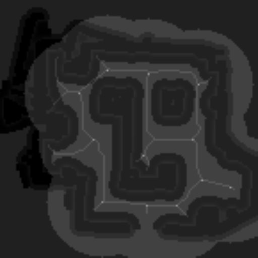
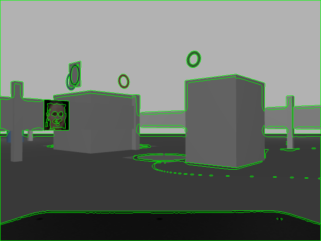
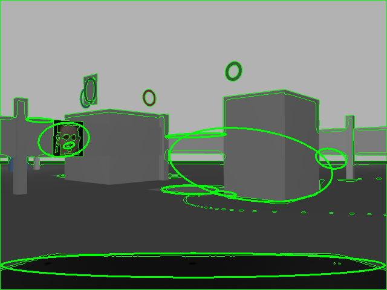
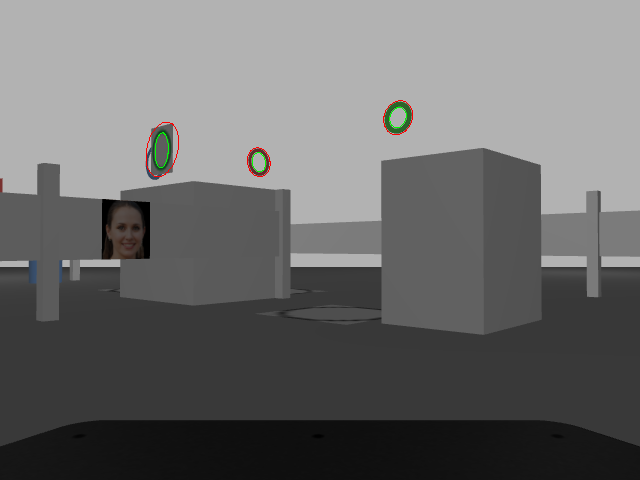
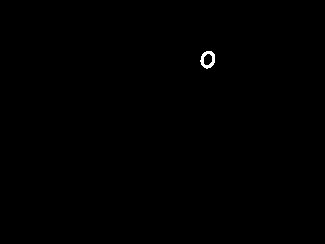
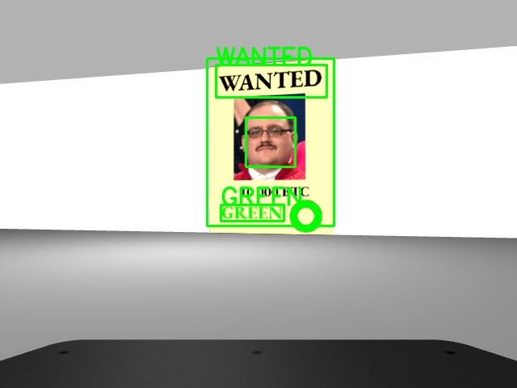
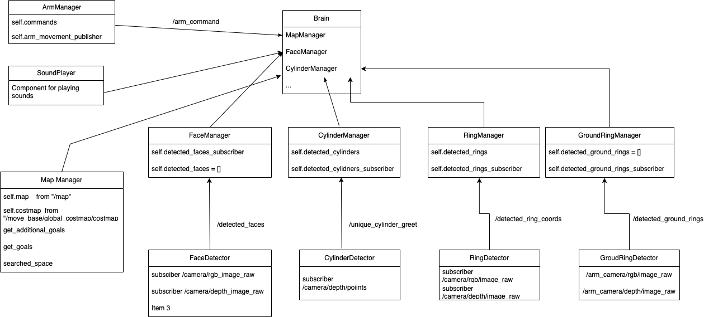

# Report

## 1. Introduction

This report documents our team's development of an autonomous robotic system. The robot's task was to navigate through a specified area, detect and recognize faces, rings, and cylinders, gather information, and execute particular actions based on its findings. The core technologies implemented include ROS (Robot Operating System), OpenCV for image processing tasks, PCL (Point Cloud Library) for 3D object recognition, and Google's MediaPipe library for face detection. There was also a task of face detecting and greeting on a real robot.

## 2. Methods

### Exploration

#### Initial Keypoints

We have created an exploration function that returns the best keypoints to visit. It does that in the following way:

1. We create a skeleton overlay of the map
2. We find the branch points on the skeleton overlay. We leverage the Harris corner detector to find the corners of the skeleton overlay. Following corner detection, we dilate the results and apply a threshold to isolate the optimal corners. These corners represent the branch points of the skeleton overlay
3. We then further filter the branch points by removing those that are too close to each other.

The resulting keypoints look like this:



#### Exploration Extended: Additional Keypoints from Searched Space

When the keypoints identified through branch points are not sufficient for exploration, the system dynamically generates more keypoints. These additional keypoints are derived from the space that has not yet been searched by the robot.

The robot maintains a record of its searched space that gets updated every 0.4 seconds, considering a radius of 10 pixels around the robot's current position. This ongoing update allows the robot to be aware of its immediate surroundings.

To complement this process, a function called get_additional_goals() identifies potential new goals from the unsearched space. This function creates a representation of the unsearched space, identifies separate clusters in this space, and then chooses new keypoints from these clusters.

In conclusion, this extended exploration strategy helps the robot more thoroughly explore its environment by not only following the skeleton overlay of the map but also dynamically identifying new regions to explore based on its current knowledge of the searched and unsearched spaces.

### Cylinder Detection

For detecting cylinders we have chosen to use the Point Cloud Library (PCL) library. We have used the following steps:

1. Downsample the point cloud data, to reduce number of points (with `voxel_grid_filter`)
2. Filter the point cloud data based on depth (z-axis `[0, 1.9]`)
3. Filter the point cloud based on the height (y-axis `[-0.3, 0.2]`)
4. Estimate **normals**
5. Perform planar segmentation to identify largest planar component, remove points on it from the point cloud
   - largest planar component is the ground
6. Perform **cylinder segmentation** using RANSAC
   - we use a model `pcl:SACMODEL_CYLINDER` to find cylindrical shape in the data.
   - then we perform up to 10000 iterations of RANSAC to find the best model

#### Cylinder Detection Clustering

When cylinder is detected, we check if there have been any other detections at this `Pose`. If there were more than 5 detections of cylinder with pose close enough (`object_proximity_threshold=1`), we assume that this is a valid detection and we publish it on the `/detected_cylinders` topic.

### Ring Detection

For the ring detection we have chosen the **two ellipse method**:

- we binarize the image using adaptive thresholding
- we extract the **contours** from the binary image
    
- we fit ellipses to all extracted contours with enough points
    
- we find the pairs of ellipses with centers close to each other. Each pair we call a **candidate**
    
- we then process each candidate in the following way
  - we calculate the coordinates of the inner and outer ellipse
  - from inner ellipse we calculate the **candidate center** (x, y)
    - we then create a squared slice of the center (8x8) and convert all pixels that have `nan` value to 0 (depth black unknown). Then we do a sum of all these center pixels and check if the sum is smaller than 0.1. If it is this means that the circle has a hole in the middle and it represents a valid ring. We also check that the detection is not too far away (distance threshold)
  - 

#### Ring Clustering

After a valid ring is detected, we check if there have been any other detection close to this `Pose`. We form RingGroups where each RingGroup represent detections corresponding to the same ring. The distance to be part of the ring group is 0.5m and is calculated using `euclidean_distance` to the average center of the ring group. Also the color of the ring group is the most common color of all the detections in the group.

### Ground Ring Detection

Works completely the same as the ring detection, but instead of checking the centre of the ring, we just check that the ring is big enough (inner_elipse > threshold). We also get the image from the arm camera which is looking directly to the ground and has a better view of the ground rings.

#### Ground Ring Clustering

Same as ring clustering.

### Face Detection

For face detection we have used google's `mediapipe library`. We are using the `mp.solutions.face_detection` module. For each image we check the short and long range detection.

1. The model takes in RGB image and outputs a confidence value
2. If the confidence value is above a threshold, we assume that a face is detected
3. We then calculate the bounding box around it., extract the depth information from the depth image and from that calculate the distance to the detected face.
4. If the face position can be determined the face is added to face clusters.

#### Face Clustering

For each face detection we check if there have been any other detections close to its `Pose`. If so add it to the same face group. If not create a new face group. When a face group has more than 3 detections it is considered as a valid face detection. This allows us to robustly detect faces even if the face detection is not very accurate.

#### Face Greet Points

For each **face group** we calculate the best **greet locations** in the following way:

1. We iterate over all the faces within the group. For each face, we extract relevant information such as the robot's coordinates, the left and right face poses, the confidence level, and the face's distance from the robot.
2. For each face we then calculate the **greet location** based on the average pose, robot coordinates and the face poses
   - we calculate a perprendicular vector to the line going through left and right face pose
   - then we choose a suitable point on this vector, based on reachability and we utilize the `breseham` algorithm to find the closest reachable point
3. We calculate the distance between the greet location and the face location using the `euclidean_distance` function
4. To determine the weight of the greet location, we multiply the confidence level by the inverse of the face's distance, and then multiply that by the distance between the greet location and the face location
5. We update the weighted greet locations by adding the current greet location multiplied by the weight, and we update the total weight by adding the weight
6. After iterating over all faces in the group, we normalize the weighted greet locations by dividing them by the total weight, resulting in the average face greet location

#### Poster detection

For poster detection we are using `easyocr` library. We are using the `en` model for english text detection. So for each face, we create an bounding box around it, then we crop this bounding box and use our `easyocr` reader to detect text. If the text is detected, the face is considered as a poster.



### Real World

We successfully implemented face detection, AMCL navigation, and greeting of faces on a real-world robot and polygon. This was a particularly challenging task due to hardware and connectivity limitations.
In our experience, we found that sunlight in the lab affected detection accuracy, and we addressed this by blinding the folds and using artificial lights. The camera stream was also significantly laggy due to limited bandwidth. We improved this by displaying not the raw RGB image stream from the camera, but a compressed version in RViz. Due to challenging environmental conditions, we had to fine-tune our face detection algorithms to increase robustness. We also slowed the robot down using AMCL parameters to mitigate the lag. It's worth noting that we never hardcoded any points on the map; the robot used exploration to find the faces, unlike other teams who just hardcoded the points in front of the faces. There's a short clip of the robot working on TikTok [Link to the video](https://www.tiktok.com/@lukadragar/video/7226414643663719707?_r=1&_t=8bpHBCdADCV).

## 3. Implementation and Integration

The `Brain` class is the main class of the system. It connects all of the detectors and other components together in the following way:

- `move_base_client`: for sending goals to the robot
- `map_manager`: for controlling the map and getting keypoints
- `velocity_publisher`: for publishing velocity commands
- `ring_manager`: for managing ring detections
- `ground_ring_manager`: for managing ground ring detections
- `face_manager`: for managing face detections
- `cylinder_manager`: for managing cylinder detections
- `arm_manager`: for controlling the robot's arm
- `sound_player`: for playing sounds
- `laser_manager`: for managing laser detections (if close to an obstacle)
- `poster_info_proxy`: for getting information about the posters
- `mercenary_infos`: for storing information about the people



### Think

The main logic is implemented in the brain's `think` function. It goes like this:

First we initialize dictionaries to storing detected objects

```python
detected_face_group_ids = set()
detected_ring_group_ids = set()
detected_cylinder_group_ids = set()
```

Then we initialize the initial goal (keypoints) using `map_manager` class:

```python
goals = self.map_manager.get_goals()
```

We also setup callback function for adjusting robot's arm, so the robot's arm don't get stuck inside flying rings:

```python
arm_cam_timer = rospy.Timer(rospy.Duration(0.5), self.auto_adjust_arm_camera)
```

Now we start the main loop, iterating through all of the goals, received from the `map_manager`. First we calculate the
optimized_path to all goals using the `nearest_neighbor_path`. Then we move to each goal and rotate 360 degrees to detect
objects. Then for each object type (face, ring, cylinder) check if there are more detections that there have been
an iteration before that. If so, we assume that a new detection has been found, in that case:

- `face`: we go and greet the face, also every time we check if the face is on the poster, using `poster_info_proxy` service, after determening if the face is a poster or just a face, we do the corresponding dialogue (PosterDialogue or FaceDialogue) to get the data, inputed via cli. The data is stored in the `MercenaryInfo` object
- `ring`: ring is added to the dict
- `cylinder`: cylinder is added to the dict

```python
while not rospy.is_shutdown() and len(goals) > 0:
    optimized_path = self.nearest_neighbor_path(goals, goals[0])

    for i, goal in enumerate(optimized_path):
        self.map_manager.publish_markers_of_goals(goals=goals, duration=500)

        rospy.loginfo(
            f"Moving to goal {i + 1}/{len(optimized_path)}. Faces detected:"
            f" {len(detected_face_group_ids)}."
        )

        goal_pose = Pose()
        goal_pose.position.x, goal_pose.position.y = goal[0], goal[1]
        goal_pose.orientation = Quaternion(0, 0, -0.707, 0.707)  # always face south
        self.move_to_goal(goal_pose)

        rospy.sleep(2.0)

        self.rotate(360, angular_speed=0.6)

        # Process new faces
        new_face_count = self.face_manager.detection_count() - len(detected_face_group_ids)
        rospy.loginfo(f" {new_face_count} new faces detected.")
        if new_face_count > 0:
            self.visit_new_faces(detected_face_group_ids)

        # Process new rings
        new_ring_count = self.ring_manager.detection_count() - len(detected_ring_group_ids)
        rospy.loginfo(f" {new_ring_count} new rings detected.")
        if new_ring_count > 0:
            self.process_new_rings(detected_ring_group_ids)

        # Process new cylinders
        new_cylinder_count = self.cylinder_manager.detection_count() - len(
            detected_cylinder_group_ids
        )
        rospy.loginfo(f" {new_cylinder_count} new cylinders detected.")
        if new_cylinder_count > 0:
            self.process_new_cylinders(detected_cylinder_group_ids)

    # Check if enough data has been collected to complete the mission
    # If not then get additional goals
    if not MercenaryInfo.are_complete(self.mercenary_infos):
        rospy.loginfo("Mercenary Infos are not complete. Adding additional goals.")
        goals = self.get_additional_goals(previous_goals=goals)
    else:
        break
```

After the initial goals have been visited, we check that the `MercenaryInfo` object is fullfilled. If not, we request `additional_goals` from the `map_manager` and repeat the process.

```python
        if not MercenaryInfo.are_complete(self.mercenary_infos):
            rospy.loginfo("Mercenary Infos are not complete. Adding additional goals.")
            goals = self.get_additional_goals(previous_goals=goals)
        else:
            break
```

After the `MercenaryInfo` object contains the full data, we extract `hiding_place_cylinder` and `prison_ring` from it.
Then we go to the `hiding_place_cylinder` and greet it. After that we perform the `parking` operation inside the prison ring.

```python
hiding_place_cylinder, prison_ring = self.get_most_wanted_data()
# Greet the target cylinder
self.move_to_goal(hiding_place_cylinder.cylinder_greet_pose)
self.sound_player.say(hiding_place_cylinder.cylinder_color)

# Park inside the prison ring
self.park_in_ring(prison_ring)
```

At the end we wave for the goodbye and play the victory sound.

## 4. Results

The robot successfully completed the mission. It was able to detect all the faces, rings and cylinders. It was also able to park inside the prison ring.

## 5. Division of work

Initially the team consisted 3 members, but after about 3 weeks one of the members left the project, due to difficulties following this course. The remaining two members continued working on the project and implemented the following:

- `Luka`:
  - exploration (branch points, additional keypoints)
  - cylinder detection,
  - poster detection,
  - parking,
  - face detection,
  - arm camera,
  - laser manager for obstacle avoidance,
- `Gašper`:
  - ring detection,
  - ground ring detection,
  - sound player,
  - dialogue manager,
  - face clustering,
  - refractoring architecture design into manager classes

The code stats can also be found on github [here](https://github.com/bl4ko/ROS/graphs/contributors).

## 6. Conclusion

The project was a great learning experience. We have learned a lot about ROS, OpenCV, PCL, and other libraries. We have also learned a lot about the process of developing a complex system. We have learned how to work in a team and how to divide the work.
